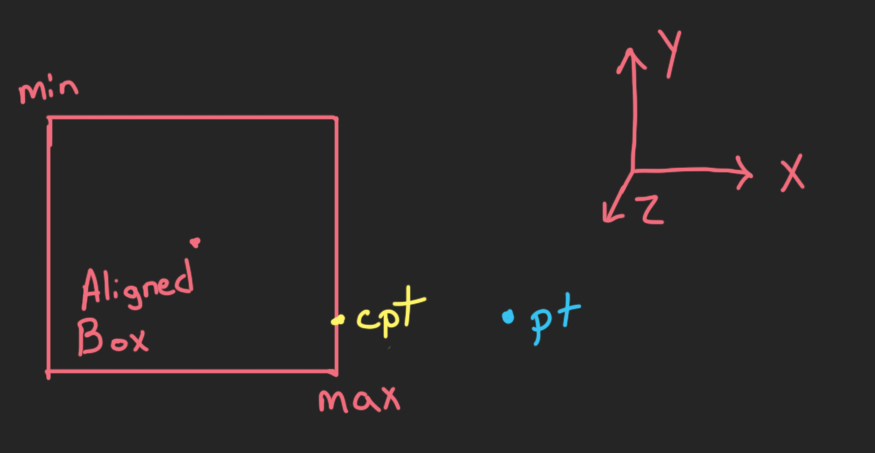

# Closest Point on Axis-Aligned Box

Given a point (pt) and box (min, max) find the closest point (cpt) that lives on or inside the box.

## Input:

	Position of Point (Vector3)
	Aligned Box Minimums (Vector3)
	Aligned Box Maximums (Vector3)
	
## Output:

	Closest Point (Vector3)
	
## Test Data:

> The following tests were confirmed via visuals with my implementation though all seemed to be correct.

	0.0000000000, 0.0000000000, 0.0000000000,
	-2.9375000000, -2.2030000687, -4.0000000000,
	2.9375000000, 2.2030000687, 4.0000000000,
	0.0000000000, 0.0000000000, 0.0000000000,

	0.0000000000, 4.0000000000, 0.0000000000,
	-2.9375000000, -2.2030000687, -4.0000000000,
	2.9375000000, 2.2030000687, 4.0000000000,
	0.0000000000, 2.2030000687, 0.0000000000,

	0.0000000000, -4.0000000000, 0.0000000000,
	-2.9375000000, -2.2030000687, -4.0000000000,
	2.9375000000, 2.2030000687, 4.0000000000,
	0.0000000000, -2.2030000687, 0.0000000000,

	-2.4970383644, 1.7733738422, 5.6983175278,
	-2.9375000000, -2.2030000687, -4.0000000000,
	2.9375000000, 2.2030000687, 4.0000000000,
	-2.4970383644, 1.7733738422, 4.0000000000,

	-5.7544531822, 3.9280934334, 5.6983175278,
	-2.9375000000, -2.2030000687, -4.0000000000,
	2.9375000000, 2.2030000687, 4.0000000000,
	-2.9375000000, 2.2030000687, 4.0000000000,

	4.3615341187, 3.9280934334, -5.0695791245,
	-2.9375000000, -2.2030000687, -4.0000000000,
	2.9375000000, 2.2030000687, 4.0000000000,
	2.9375000000, 2.2030000687, -4.0000000000,

	4.3615341187, -0.5523153543, 0.2682416439,
	-2.9375000000, -2.2030000687, -4.0000000000,
	2.9375000000, 2.2030000687, 4.0000000000,
	2.9375000000, -0.5523153543, 0.2682416439,

	4.3615341187, -2.5197031498, 0.2682416439,
	-2.9375000000, -2.2030000687, -4.0000000000,
	2.9375000000, 2.2030000687, 4.0000000000,
	2.9375000000, -2.2030000687, 0.2682416439,

	-2.4136698246, -1.9557943344, 0.2682416439,
	-2.9375000000, -2.2030000687, -4.0000000000,
	2.9375000000, 2.2030000687, 4.0000000000,
	-2.4136698246, -1.9557943344, 0.2682416439,

	-4.4688110352, -0.1857507825, 0.3306763768,
	-3.0000000000, -0.7814999819, -2.0315001011,
	3.0000000000, 0.7814999819, 2.0315001011,
	-3.0000000000, -0.1857507825, 0.3306763768,

	-0.5161700845, -0.1857508123, -3.7414808273,
	-3.0000000000, -0.7814999819, -2.0315001011,
	3.0000000000, 0.7814999819, 2.0315001011,
	-0.5161700845, -0.1857508123, -2.0315001011,

	-0.5161700845, -0.1857508123, 5.7473978996,
	-3.0000000000, -0.7814999819, -2.0315001011,
	3.0000000000, 0.7814999819, 2.0315001011,
	-0.5161700845, -0.1857508123, 2.0315001011,
