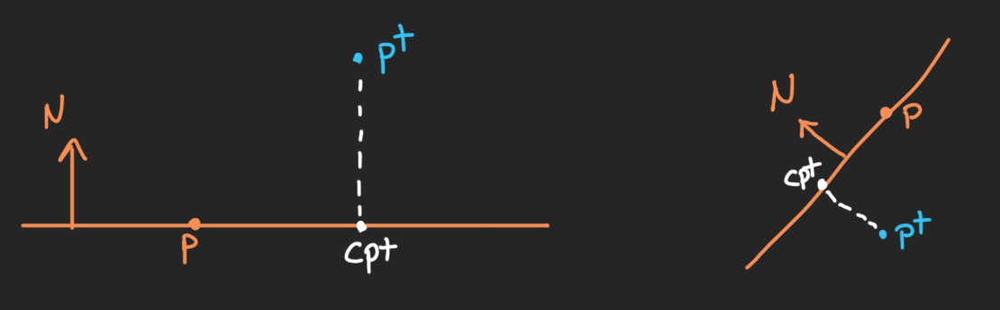

# Closest Point on Plane

Given a point (pt) and plane (p, N) find the closest point (cpt) that lives on the plane.

## Formula

)%20\cdot%20N)

## Input:

	Position on Plane (Vector3)
	Normal of Plane (Vector3)
	Position of Point (Vector3)
	
## Output:

	Closest Point (Vector3)
	
## Test Data:

> The following tests were confirmed via visuals with my implementation though all seemed to be correct.

	0.0000000000, 2.7120659351, 0.0000000000,
	0.0000000000, 0.0000000000, 0.0000000000,
	0.0000000000, 1.0000000000, 0.0000000000,
	0.0000000000, 0.0000000000, 0.0000000000,

	5.5872645378, 2.7120659351, 0.0000000000,
	0.0000000000, 0.0000000000, 0.0000000000,
	0.0000000000, 1.0000000000, 0.0000000000,
	5.5872645378, 0.0000000000, 0.0000000000,

	5.5872645378, 2.7120659351, 8.7528076172,
	0.0000000000, 0.0000000000, 0.0000000000,
	0.0000000000, 1.0000000000, 0.0000000000,
	5.5872645378, 0.0000000000, 8.7528076172,

	-4.1520657539, 2.7120661736, -6.7660388947,
	0.0000000000, 0.0000000000, 0.0000000000,
	0.0000000000, 1.0000000000, 0.0000000000,
	-4.1520657539, 0.0000000000, -6.7660388947,

	-4.1520657539, 2.7120661736, -6.7660388947,
	0.0000000000, 1.5000000000, 0.0000000000,
	0.0000000000, 1.0000000000, 0.0000000000,
	-4.1520657539, 1.5000000000, -6.7660388947,

	-1.8392996788, 2.7120668888, 7.2737479210,
	0.0000000000, 1.5000000000, 0.0000000000,
	0.0000000000, 1.0000000000, 0.0000000000,
	-1.8392996788, 1.5000000000, 7.2737479210,

	3.6901671886, 8.5452451706, 7.2737479210,
	0.0000000000, 1.5000000000, 0.0000000000,
	0.0000000000, 1.0000000000, 0.0000000000,
	3.6901671886, 1.5000000000, 7.2737479210,

	3.6901671886, -5.9772539139, 7.2737479210,
	0.0000000000, 1.5000000000, 0.0000000000,
	0.0000000000, 1.0000000000, 0.0000000000,
	3.6901671886, 1.5000000000, 7.2737479210,

	-9.8285102844, -5.9772534370, -11.1289148331,
	0.0000000000, 1.5000000000, 0.0000000000,
	0.0000000000, 1.0000000000, 0.0000000000,
	-9.8285102844, 1.5000000000, -11.1289148331,

	5.2695379257, 1.5000000000, 9.4587421417,
	0.0000000000, 1.5000000000, 0.0000000000,
	0.0000000000, 1.0000000000, 0.0000000000,
	5.2695379257, 1.5000000000, 9.4587421417,

	-6.1936974525, 1.5000000000, -3.5759503841,
	0.0000000000, 1.5000000000, 0.0000000000,
	0.0000000000, 1.0000000000, 0.0000000000,
	-6.1936974525, 1.5000000000, -3.5759503841,

	-6.1936974525, 1.5000000000, -3.5759503841,
	0.0000000000, 1.5000000000, 0.0000000000,
	0.7753294110, 0.6315547228, 0.0000000000,
	-2.4704341888, 4.5328330994, -3.5759503841,

	-6.1936974525, 1.5000000000, -3.5759503841,
	0.0000000000, 1.5000000000, 0.0000000000,
	0.1581728309, 0.6315550208, -0.7590206861,
	-6.4680576324, 0.4045310020, -2.2593848705,

	-6.1936974525, 1.5000000000, -3.5759503841,
	0.0000000000, 1.5000000000, 0.0000000000,
	0.1581762135, -0.6204378009, -0.7681335211,
	-6.4732146263, 2.5963916779, -2.2185616493,

	-6.1936974525, 1.5000000000, -3.5759503841,
	0.0000000000, 7.4174861908, -4.6677885056,
	0.1581762135, -0.6204378009, -0.7681335211,
	-6.4868097305, 2.6497173309, -2.1525421143,

	-6.1936974525, 1.5000000000, -3.5759503841,
	0.0000000000, 7.4174861908, -4.6677885056,
	-0.3486513495, -0.5370330215, -0.7681335807,
	-4.6252241135, 3.9159440994, -0.1203572750,

	-6.1936974525, 1.5000000000, -3.5759503841,
	130.5062866211, 7.4174861908, 200.1797180176,
	-0.3486435115, -0.5443680882, -0.7629547119,
	65.7452392578, 113.8246459961, 153.8517761230,

## References

Real-Time Collision Detection - Christer Ericson
